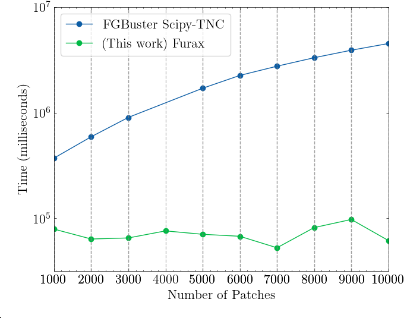

# FURAX Component Separation

[](https://badge.fury.io/py/furax-cs)
[](https://opensource.org/licenses/MIT)
[](https://github.com/pre-commit/pre-commit)

**FURAX-CS** (FURAX Component Separation) is a Python package designed to benchmark and implement advanced component separation techniques for Cosmic Microwave Background (CMB) analysis. It leverages **JAX** for high-performance computing on GPUs and implements novel adaptive clustering methods.

This project specifically focuses on comparing:
*   **FGBuster**: parametric component separation (standard).
*   **FURAX**: Adaptive, gradient-based separation with spatially varying spectral parameters.

### Furax ADABK

Furax CS is a comprehensive software package designed for Component Separation for the Cosmic Microwave Background (CMB) data analysis.
The main tool is the minimizer provided under the name of Furax ADABK which is an adaptive gradient based optimizer specifically designed to handle extremely noise dominated data such as CMB observations and physical bound constraints.
The minimizer is orders of magnitude faster than traditional minimizers such as Scipy-TNC and is able to reach lower minima in fewer iterations.

<p align="center">
  
</p>

This provides a much easier and faster way to explore the spatial variability of foregrounds and their impact on the CMB recovery.

This has an impact on the estimated r tensor-to-scalar ratio as shown in the figure below where we compare the likelihood profiles obtained with using the KMeans spatial clustering gridding runs and compared with [LiteBIRD PTEP-like](https://arxiv.org/abs/2202.02773) run obtained using FGBuster using multiresolution spatial clustering.

<p align="center">
  
</p>

---

## Installation

### 1. Prerequisites (JAX)
This package depends on JAX. To enable GPU acceleration (highly recommended), you must install the CUDA version of JAX **before** installing this package.

**For NVIDIA GPUs:**
```bash
pip install -U "jax[cuda]"
```

**For CPU only:**
```bash
pip install jax
```

### 2. Install Package
Clone the repository and install in editable mode:

```bash
pip install furax-cs[all] # or choose specific extras: plotting, benchmarks
```

---

## Documentation

*   **[Quick Start (Python API)](docs/quick_start.md)**: Learn how to use the Python API for data loading and running component separation.
*   **[CLI Reference & Workflow](docs/cli_reference.md)**: Comprehensive guide on using the command-line interface for the full analysis pipeline.
*   **[Minimization Solvers](docs/minimization.md)**: Guide to available optimization algorithms (Active Set, L-BFGS, etc.) and programmatic usage.
*   **[Analysis Tools (r_analysis)](docs/r_analysis.md)**: Detailed documentation for the result analysis and plotting suite.

---

## Development

### Running Tests
```bash
pytest
```

### Pre-commit Hooks
Ensure code quality before committing:
```bash
pre-commit install
pre-commit run --all-files
```
